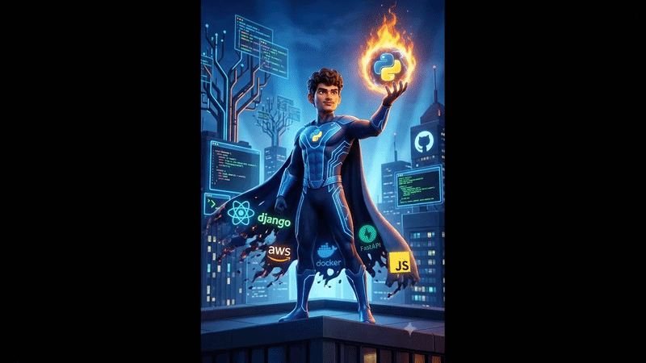

<div align="center">

  <!-- HERO TITLE & TAGLINE -->
  <h1>⚡ Keshav Shrivastava ⚡</h1>
  <h3>🚀 Generative & Agentic AI Engineer</h3>
  
  <p align="center">
    <strong>Architecting deterministic, production-grade Generative AI systems, RAG pipelines & Autonomous Multi-Agent Workflows.</strong>
  </p>

  <!-- SOCIAL CONNECT BADGES -->
  <p align="center">
    <a href="https://www.linkedin.com/in/kesxhavshrivastava" target="_blank">
      
    </a>
    <a href="https://github.com/01-Keshav?tab=repositories" target="_blank">
      
    </a>
    <a href="mailto:keshav.shrivastava.ld@gmail.com">
      
    </a>
    <a href="https://www.instagram.com/__kesxhav__?stkn=bWUxZTdmbDQ5dHdx" target="_blank">
      
    </a>
    <a href="https://github.com/01-Keshav" target="_blank">
      
    </a>
  </p>

  <br />

  <!-- ANIMATED MEDIA SHOWCASE -->
  <a href="https://github.com/01-Keshav">
    
  </a>

</div>

<br />

---

### 👨‍💻 Executive Summary

> **Software Engineer** specializing in building production-ready **Generative AI systems**, **Retrieval-Augmented Generation (RAG)** pipelines, and **Autonomous Agentic Workflows**. I bridge the gap between bleeding-edge foundation models and deterministic, reliable software architectures equipped with strict guardrails, low-latency execution, and high contextual precision.

```yaml
Current Focus:
  - Architecture: Multi-Agent Systems & Graph-based LLM Workflows (LangGraph, AutoGen)
  - Search & Retrieval: Advanced Hybrid RAG (Dense + Sparse + Semantic Reranking)
  - Reliability: Hallucination Mitigation & Deterministic Guardrails (RAGAS, NeMo)
  - Performance: Context Optimization, Model Quantization & Token Efficiency
```

---

### 🛠️ Core Competencies & Technical Architecture

<table>
  <tr>
    <td width="50%" valign="top">
      <h4>🤖 LLM Architecture & Orchestration</h4>
      <ul>
        <li><strong>Prompt Engineering:</strong> Few-Shot, CoT, ReAct Pattern, Structured Outputs</li>
        <li><strong>Agentic Workflows:</strong> Multi-Agent Swarms, Tool & Function Calling, Dynamic Routing</li>
        <li><strong>Context Optimization:</strong> Context Window Management, Token Pruning, Cost Control</li>
        <li><strong>Frameworks:</strong> LangChain, LangGraph, LlamaIndex, LiteLLM, Ollama</li>
      </ul>
    </td>
    <td width="50%" valign="top">
      <h4>🔍 Information Retrieval & Vector Systems</h4>
      <ul>
        <li><strong>Search Paradigms:</strong> Dense, Sparse (BM25) & Hybrid Search</li>
        <li><strong>Chunking Strategies:</strong> Semantic Chunking, Recursive & Contextual Splits</li>
        <li><strong>Post-Retrieval:</strong> Cross-Encoder Reranking, Reciprocal Rank Fusion (RRF)</li>
        <li><strong>Vector Stores:</strong> ChromaDB, FAISS, Pinecone, pgvector</li>
      </ul>
    </td>
  </tr>
  <tr>
    <td width="50%" valign="top">
      <h4>⚡ Backend & API Engineering</h4>
      <ul>
        <li><strong>Languages & Runtimes:</strong> Python 3 (OOP, AsyncIO, Typing, Pydantic v2)</li>
        <li><strong>Web Services:</strong> FastAPI, Uvicorn, RESTful Endpoints, WebSockets</li>
        <li><strong>Databases:</strong> PostgreSQL, SQLite, SQL Query Optimization</li>
        <li><strong>Design:</strong> Modular Microservices, Rate Limiting, Async Pipelines</li>
      </ul>
    </td>
    <td width="50%" valign="top">
      <h4>🛡️ Evaluation, Guardrails & MLOps</h4>
      <ul>
        <li><strong>Evaluation:</strong> RAG Triad Metrics (Faithfulness, Relevance), RAGAS Framework</li>
        <li><strong>Guardrails:</strong> Hallucination Mitigation, NeMo Guardrails, Input/Output Sanitization</li>
        <li><strong>Deployment:</strong> Docker, Containerization, Streamlit, Hugging Face Hub</li>
        <li><strong>Optimization:</strong> Model Quantization (GGUF/AWQ), Inference Latency Optimization</li>
      </ul>
    </td>
  </tr>
</table>

---

### 💻 Tech Stack & Toolkit

<div align="center">

#### 🧠 AI & Agentic Frameworks
<p>
  
  
  
  
  
  
</p>

#### 🗄️ Vector Databases & Storage
<p>
  
  
  
  
  
</p>

#### ⚙️ Backend, Languages & DevOps
<p>
  
  
  
  
  
  
</p>

</div>

---

### 📊 GitHub Activity & Analytics

<div align="center">

  <!-- STATS & TOP LANGS CARDS WITH HIGH-CONTRAST VIBRANT ICONS -->
  <p align="center">
    <a href="https://github.com/01-Keshav">
      
    </a>
    <a href="https://github.com/01-Keshav">
      
    </a>
  </p>

  <!-- STREAK STATS (HIGH-PERFORMANCE DEMOLAB ENDPOINT) -->
  <p align="center">
    <a href="https://github.com/01-Keshav">
      
    </a>
  </p>

</div>

---

### 🤝 Let's Connect & Collaborate

<div align="center">

  <p>
    I am always excited to discuss <strong>Generative AI architecture</strong>, <strong>Agentic Systems</strong>, <strong>RAG optimization</strong>, or collaborative high-impact AI opportunities.
  </p>

  <p>
    <a href="mailto:keshav.shrivastava.ld@gmail.com">
      
    </a>
    <a href="https://www.linkedin.com/in/kesxhavshrivastava" target="_blank">
      
    </a>
    <a href="https://github.com/01-Keshav?tab=repositories" target="_blank">
      
    </a>
  </p>

  <sub>⚡ Designed & Engineered with precision by <strong>Keshav Shrivastava</strong> ⚡</sub>

</div>
